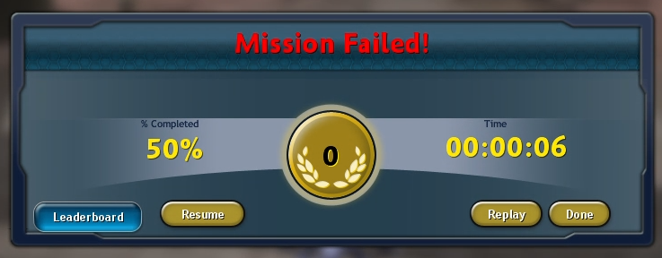

# Adventure Checkpoints

### Video Demonstration: https://www.youtube.com/watch?v=vBlM3RKrvws
### Latest release can be found [here](https://github.com/Liskomato/Spore-AdventureCheckpoints/releases/latest).

A new kind of Spore ModAPI mod which will allow players to restore their progress on failed adventures - something unheard of for over 14 years!

This mod adds a checkpoint system to Spore: Galactic Adventures where if you fail an adventure in any way, you will now be able to restart from the start of act you were on, not just from act 1 (though this option is still available for you if you wanted to restart from the beginning). 

Also, when you use the checkpoint system to restart from an act, your time and summary will also be restored for the next attempt, meaning you can get a total amount of time taken to complete an adventure when you actually manage to finish it (including with counting the deaths that you took in that time, although failing goals like Protect won't count for that).

The mod will also come with three new cheats such as a cheat to jump to any act of your choosing with a time penalty of 30 minutes per act when going forward, a cheat that will allow you to use checkpoints in act 1 or after completing an adventure, and a cheat to check the current settings of the mod.

## In summary...
- New button has been added to the adventure results screen: ``Resume``
  - Said button will restart the adventure, starting from the act you failed/succeeded in. Your play summary and time are preserved.
- New cheats: ``gotoact``, ``checkpointsExtended`` and ``checkpointsStatus``
   - `gotoact`
      - How to use: input ``gotoact <act>`` in the cheat console (``CTRL+SHIFT+C``), with `<act>` being the number of the act you want to enter
      - Using said cheat to go forward in acts will incur a penalty of 30 minutes per act skipped.
   - `checkpointsExtended`
      - Usage: Inputting the cheat will toggle whether checkpoints appear in situations outside of adventure failure after act 1.
   - `checkpointsStatus`
      - Will print current state of boolean values associated with the mod.
      - Two values: `checkpointsExtended` status and if Time and Deaths is visible.
- New UI element: Time and Deaths
   - Said UI element will appear in adventure play mode, and will tell your current time and deaths during the adventure. 
   - Deaths are retrieved from the play summary, and unfortunately it doesn't count failed goals as deaths.
   - Visibility toggled with `T` key.
- Ability to reset current adventure act with keybind `CTRL+R`
   - Will keep current time and summary of the adventure in progress.
   - Not recommended for longer acts unless the adventure is softlocked.
- Supported languages: English, Finnish, Swedish, Norwegian, Danish, Japanese, Polish, Spanish, Russian, German

## Credits
* Liskomato - Concept, design, main developer
* emd4600 - Developer of Spore ModAPI, assistance with mod

### Translators
* Liskomato - English, Finnish, Swedish, Norwegian, Danish
* Valla-chan - Japanese
* Auntie Owl - Polish
* emd4600 - Spanish
* 0KepOnline - Russian
* PoliceOfficer07 - German

### Testers
* Derezzed
* ERROR!
* Monckat
* Benjami
* Junkinator
* Khekhenan/Sillver Wolf
* Miikka64
* sickleandsuckle/HRmatthew
* I_am_THEdragon
* Your Friend the Dragon/loldude555
